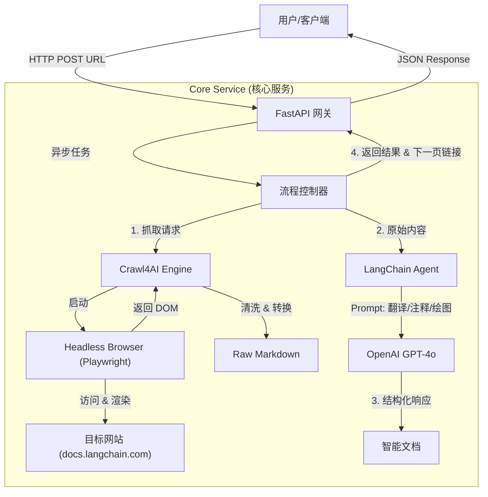

***

# 📘 SmartDoc Assistant (基于 Crawl4AI)

**SmartDoc Assistant** 是一个高性能、智能化的网页技术文档处理引擎。

本项目旨在解决“阅读英文技术文档难、代码理解晦涩、逻辑关系复杂”的痛点。它利用 **Crawl4AI** 强大的异步爬取与 Markdown 转换能力，结合 **LangChain** 与 **LLM**（大语言模型），将任意动态渲染的技术文档（如 LangChain, React 等文档）转化为**中文**、**带行级代码注释**、且**包含可视化流程图**的优质 Markdown 内容。

---

## 🛠 技术架构与选型

本项目采用 **Micro-Service** 风格的架构设计，核心技术栈如下：

### 1. 核心技术栈
| 组件 | 选型 | 选型理由 |
| :--- | :--- | :--- |
| **爬虫引擎** | **Crawl4AI** | 基于 Playwright 封装，专为 LLM 设计。支持 JS 动态渲染，自动抗指纹，内置 HTML 转 Markdown 算法，且完全异步。 |
| **Web 框架** | **FastAPI** | 高性能异步 Python Web 框架，完美契合 Crawl4AI 的 `async/await` 特性，提供自动化的 Swagger 文档。 |
| **逻辑编排** | **LangChain / LangGraph** | 管理 Prompt 模板、LLM 调用链以及状态流转。LangGraph 使得复杂的“获取->解析->生成”工作流可视化且可控。 |
| **大模型** | **GPT-4o** (或 Claude 3.5) | 拥有极强的指令遵循能力，能够精准实现“代码行级注释”和“Mermaid 图表生成”。 |
| **部署容器** | **Docker** | 标准化交付，解决 Playwright 复杂的系统依赖问题。 |

### 2. 系统架构图



---

## 🚀 功能特性

### 当前已实现功能 (v1.0)
1.  **动态网页渲染**: 完美支持 React/Vue 等构建的 SPA（单页应用）文档，解决传统爬虫无法获取内容的问题。
2.  **智能 Markdown 转换**: 自动去除广告、导航栏、页脚，仅保留核心技术内容。
3.  **精准中文化**: 保持专业术语准确性的同时，将说明性文本翻译为流畅中文。
4.  **代码行级注释**: 识别代码块（Python/JS/Go等），在关键代码行尾自动追加 `# 中文解释`，辅助代码阅读。
5.  **Mermaid 可视化**: 自动理解文本中的架构描述或图片意图，重绘为 Mermaid 流程图/时序图。
6.  **链接发现**: 自动提取当前页面内的有效子链接，支持外部循环调用以实现全站处理。

### 规划中功能 (Roadmap)
*   [ ] **向量化存储 (RAG)**: 将处理后的文档存入 Milvus/Pinecone，构建私有知识库问答。
*   [ ] **增量更新**: 基于 URL 的 Hash 对比，仅重新爬取更新过的文档页面。
*   [ ] **多格式导出**: 支持导出为 PDF 或 Notion 页面。
*   [ ] **可视化前端**: 基于 Streamlit 或 Next.js 的用户交互界面。

---

## 📂 项目结构

```text
smart-doc-assistant/
├── app/
│   ├── __init__.py
│   ├── main.py              # FastAPI 入口
│   ├── core/
│   │   ├── config.py        # 环境变量配置
│   │   └── llm.py           # LLM 初始化与 Prompt 定义
│   ├── services/
│   │   ├── crawler.py       # Crawl4AI 封装服务
│   │   └── processor.py     # 文档处理逻辑
│   └── models/
│       └── schemas.py       # Pydantic 数据模型
├── Dockerfile               # 生产环境 Docker 构建文件
├── docker-compose.yml       # 容器编排
├── requirements.txt         # Python 依赖
└── README.md                # 说明文档
```

---

## 💻 开发环境搭建 (Local Development)

### 前置要求
*   Python 3.10+
*   OpenAI API Key

### 步骤

1.  **克隆项目**
    ```bash
    git clone https://github.com/zgl610329-wq/smart-doc-assistant.git
    cd smart-doc-assistant
    ```

2.  **创建虚拟环境**
    ```bash
    python -m venv venv
    source venv/bin/activate  # Mac/Linux
    # venv\Scripts\activate   # Windows
    ```

3.  **安装依赖**
    ```bash
    # 安装核心库与 Crawl4AI
    pip install -r requirements.txt
    
    # 这一步至关重要：安装 Playwright 浏览器内核
    playwright install chromium
    ```

4.  **配置环境变量**
    创建 `.env` 文件：
    ```ini
    OPENAI_API_KEY=sk-your-api-key-here
    OPENAI_MODEL=gpt-4o
    LOG_LEVEL=INFO
    ```

5.  **启动服务**
    ```bash
    uvicorn app.main:app --reload --host 0.0.0.0 --port 8000
    ```

6.  **测试接口**
    访问 `http://localhost:8000/docs` 并使用 `/process` 接口测试。

---

## 🐳 生产环境部署 (Production)

在生产环境中，我们推荐使用 Docker 部署，因为 Playwright 对系统库有特定依赖，Docker 镜像能保证环境的一致性。

### 1. Dockerfile 编写
本项目基于微软官方 Playwright 镜像构建，以确保浏览器环境稳定。

```dockerfile
# 使用包含 Playwright 依赖的官方镜像
FROM mcr.microsoft.com/playwright/python:v1.44.0-jammy

WORKDIR /app

# 设置环境变量，防止 Python 生成 .pyc 文件
ENV PYTHONDONTWRITEBYTECODE=1
ENV PYTHONUNBUFFERED=1

# 安装依赖
COPY requirements.txt .
RUN pip install --no-cache-dir -r requirements.txt

# 再次运行 playwright install 确保 chromium 就绪 (尽管基础镜像可能已包含，但为了稳健)
RUN playwright install chromium

# 复制项目代码
COPY . .

# 暴露端口
EXPOSE 8000

# 使用 Gunicorn 管理 Uvicorn worker
CMD ["gunicorn", "app.main:app", "--workers", "4", "--worker-class", "uvicorn.workers.UvicornWorker", "--bind", "0.0.0.0:8000"]
```

### 2. Docker Compose 编排

```yaml
version: '3.8'

services:
  smart-doc-api:
    build: .
    container_name: smart-doc-api
    restart: always
    ports:
      - "8000:8000"
    environment:
      - OPENAI_API_KEY=${OPENAI_API_KEY}
    volumes:
      - ./logs:/app/logs
```

### 3. 部署命令

```bash
# 构建并后台启动
docker-compose up -d --build

# 查看日志
docker-compose logs -f
```

---

## 🔌 API 接口说明

### POST `/api/v1/process`

核心接口，用于处理单个网页。

**Request Body:**
```json
{
  "url": "https://docs.langchain.com/oss/python/langchain/overview",
  "recursion_depth": 0  // 0 表示仅处理当前页
}
```

**Response:**
```json
{
  "status": "success",
  "data": {
    "url": "https://docs.langchain.com/...",
    "title": "LangChain Overview",
    "markdown_content": "# LangChain 概览\n\nLangChain 是一个框架... \n\n```python\nimport langchain # 导入langchain主库\n```",
    "discovered_links": [
      "https://docs.langchain.com/docs/introduction",
      "https://docs.langchain.com/docs/concepts"
    ]
  }
}
```